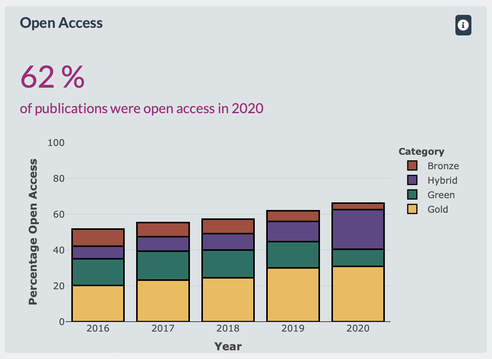

```{r setup, include=FALSE}
knitr::opts_chunk$set(echo = FALSE,
                      warning = FALSE,
                      message = FALSE)

library(tidyverse)
```

## Open Access Assessment
The analysis of the open access status of journal articles is well established. A variety of methods and tools exist. In a nutshell, the following steps are necessary.

```{r, echo = FALSE}
DiagrammeR::grViz("digraph {
  graph [layout = dot, rankdir = TB]
  
  node [shape = rectangle, fontname = Helvetica, color = white, style = filled, fillcolor = '#70acc0']        
  rec1 [label = 'Step 1. Searching for Charité publications in bibliographic databases']
  rec2 [label = 'Step 2. Querying article DOIs via Unpaywall API']
  rec3 [label =  'Step 3. Reporting results']
  
  # edge definitions with the node IDs
  rec1 -> rec2 -> rec3
  }",
  height = 300)
```

#### Step 2. Querying article DOIs via Unpaywall API

```{r, echo = TRUE, eval = FALSE}
article_dois <- "10.1186/s13073-020-00771-0"
output_unpaywall <- roadoi::oadoi_fetch(dois = article_dois,
                                        email = "jan.taubitz@charite.de",
                                        .progress = "text")
```

```{r}
#save(output_unpaywall, file = "docs/presentation_data/output_unpaywall.Rdata")
load("presentation_data/output_unpaywall.Rdata")
```

```{r, echo = TRUE}
dplyr::glimpse(output_unpaywall)
```

#### Step 3. Reporting of results




## Open Data Assessment

In comparison, considerably more steps are required to perform an open data assessment.

```{r, echo = FALSE}
DiagrammeR::grViz("digraph {
  graph [layout = dot, rankdir = TB]
  
  node [shape = rectangle, fontname = Helvetica, color = white, style = filled, fillcolor = '#70acc0']        
  rec1 [label = 'Step 1. Searching for Charité publications in bibliographic databases']
  rec2 [label = 'Step 2. Text mining of article full texts with ODDPub']
  rec3 [label = 'Step 3. Screening of data statements with Numbat']
  rec4 [label = 'Step 4. Manually verifying research data ids']
  rec5 [label = 'Step 5. Querying servers of FAIR assessment tools like F-UJI or FAIR Enough']
  rec6 [label = 'Step 6. Extracting FAIR scores and other test results from JSON files']
  rec7 [label = 'Step 7. Enriching results with data from Unpaywall, FoR, re3data ...']
  rec8 [label = 'Step 8. Reporting results']
  
  # edge definitions with the node IDs
  rec1 -> rec2 -> rec3 -> rec4 -> rec5 -> rec6 -> rec7 -> rec8
  }",
  height = 600)
```

#### Step 7. Final data table
```{r}
# load("output-Rdata/charite_rd_2020_final.Rdata")
# save(charite_rd_2020_final, file = "docs/presentation_data/charite_rd_2020_final.Rdata")
load("presentation_data/charite_rd_2020_final.Rdata")
```

```{r, echo = TRUE}
dplyr::glimpse(head(charite_rd_2020_final, 1))
```

```{r}
setwd("/Users/jan/Documents/OneDrive - Charité - Universitätsmedizin Berlin/_BIH/BUA-Dashboards/fair-assessment")
source("R/07_b_charts.R")
```

#### Step 8. Reporting results

```{r}
chart_violin_repository_plotly

partial_bundle(licenses_bar_grouped)

partial_bundle(rep_bar_freq)

partial_bundle(rep_bar_fair)
```

### Ressources

- [Charité Dashboard on Responsible Research](https://s-quest.bihealth.org/charite-dashboard/)
- [ODDPub](https://github.com/quest-bih/oddpub)
- [Numbat](https://github.com/bgcarlisle/Numbat)
- [F-UJI Webdemo](https://www.f-uji.net/?action=test)
- [FAIR Enough Webdemo](https://fair-enough.semanticscience.org)
- [GitHub repository of FAIR assessment](https://github.com/quest-bih/fair-assessment)
